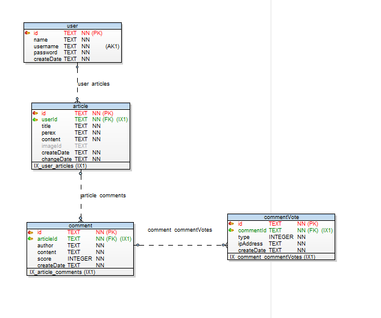
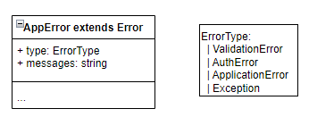
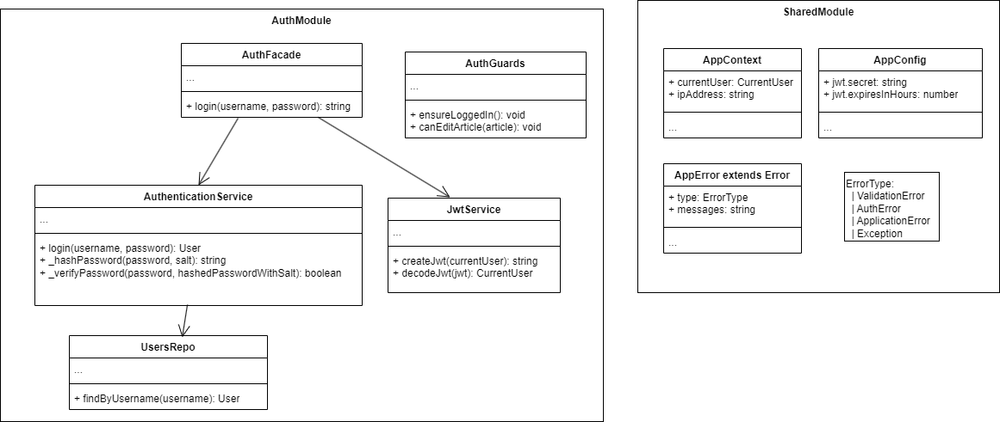

# Applifting Blog Assignment (Backend)
## Zadání
- viz https://github.com/Applifting/fullstack-exercise/blob/master/assignment.md

## Spuštění
- pro úvodní naistalování balíčků spustit `npm install`
- následně spustit pomocí `npm start`
  - násleně běží na http://localhost:3000
  - api dokumentace dostupná na http://localhost:3000/api (swagger)

## Databáze
- jako databáze použita `sqlite` (popravdě také kvůli tomu, že docker bych musel trošku nastudovat)
- jako orm nakonec použito `objection`
- do db uložen testovací uživatel: `testadmin`/`Heslo123`
- schema db:
  
- comment.score - redundantní počítání score

## Struktura projektu
- použit NestJS framework

### 'REST' api
- zatím řešeno pouze pomocí 'REST' api, přičemž použity pouze GET metody pro query, a POST metody pro commandy

### Errorové stavy
- původně jsem chtěl k předávání errorových stavů použít Result Object, ale kvůli zmenšení 'ukecanosti' jsem nakonec použil vyhazování aplikační výjimky AppError. Tato výjimka je pak ve filtru odchytávána a přeložena do Result Objectu (není to úplně nutné, možno přeložit do Nest Exceptions)



```ts
export type Result<T> = {
    success: true,
    data: T,
} | {
    success: false,
    errorType: ErrorType,
    errorMessages: string[],
}
```

- odchytávání výjimky a zabalení do ResultObjectu se děje v `GlobalExceptionFilter.ts`
- zabalení succes resposu do Result Objectu se děje v `ResultInterceptor.cs`

### Moduly
- rozděleno do 4 modulů: AuthModule, ArticlesModule, CommentsModule a SharedModule



#### AuthModule

##### Autentikace
  - autentikace pomocí jwt tokenu (posílaného v authorizetion http hlavičce). Neřešen refresh tokenu.
  - v `AuthenticationMiddleware.ts` se přečte jwt token, ověří se a následně se uloží do `AppContext.currentUser`. Do `AppContext.ipAddress` se uloží ip adresa.

##### Autorizace
  - logika autorizace zapouzdřena v tříde `AuthGuards.ts`

#### SharedModule
  - sdílené věci

#### ArticlesModule, CommentModule (Feature moduly)
  - tenké controllery, z logiky řeší pouze validaci (využita `ValidationPipe`)
  - jinak veškerá logika uvnitř fasád (metody controlleru odpovídají 1:1 metodám fasády)

  ##### WebSockets notifikace
  - řešeny v `CommentsGateway.ts`


#### TODOs
  - na prvním místě integrační testy, unit testy
  - nahrávání obrázků (ImagesModule)
  - GraphQL - zatím neimplementováno 
  - PostgreSQL - robusnější datová vrstva, transakce
  - docker
  - refresh jwt tokenu
  - vylepšení swagger dokumentace
  - config ze souboru
  - prod build
